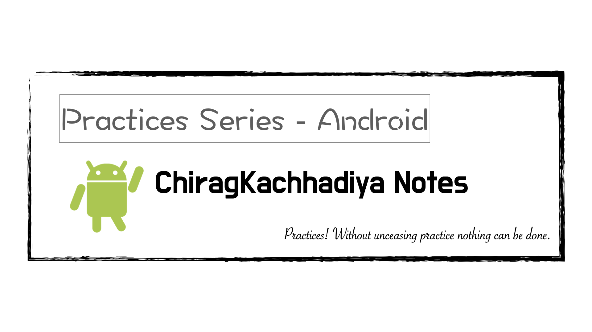
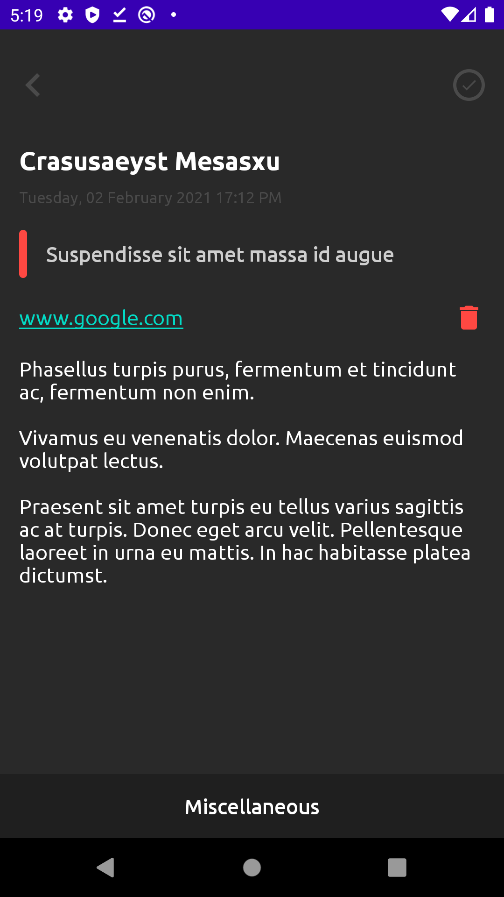

# ChiragKachhadiya Notes
項目實戰（Android）：ChiragKachhadiya Notes

---

---

### 說明 ###

本專案為「[Chirag Kachhadiya](https://www.youtube.com/channel/UCmL5TAblHHgh1xhabmPjYgw)」分享於「Youtube」平台。

###### 參考連結： ######

- [Android Development | Notes App | Tutorial #1 | Primary Layout Design | Android Studio](https://www.youtube.com/watch?v=hlkekoPqsis&list=PLam6bY5NszYN6-a1wt7yRISWfmYPdkbMu)
- [Android Development | Notes App | Tutorial #2 | Database Setup | Room Persistence Library](https://www.youtube.com/watch?v=CeqTvDfN6NM&list=PLam6bY5NszYN6-a1wt7yRISWfmYPdkbMu&index=2)
- [Android Development | Notes App | Tutorial #3 | Create & Save Note | Android Studio](https://www.youtube.com/watch?v=RWYXbOCoVYk&list=PLam6bY5NszYN6-a1wt7yRISWfmYPdkbMu&index=3)
- [Android Development | Notes App | Tutorial #4 | Display Notes | Recycler View | Android Studio](https://www.youtube.com/watch?v=BrLnsDkoba0&list=PLam6bY5NszYN6-a1wt7yRISWfmYPdkbMu&index=4)
- [Android Development | Notes App | Tutorial #5 | Note Color | Android Studio](https://www.youtube.com/watch?v=Xpd9E4CD84Q&list=PLam6bY5NszYN6-a1wt7yRISWfmYPdkbMu&index=5)
- [Android Development | Notes App | Tutorial #6 | Add Image In Note | Android Studio](https://www.youtube.com/watch?v=1AHzkfPacM0&list=PLam6bY5NszYN6-a1wt7yRISWfmYPdkbMu&index=6)
- [Android Development | Notes App | Tutorial #7 | Add URL In Note | Android Studio](https://www.youtube.com/watch?v=xlfkz7nSvSE&list=PLam6bY5NszYN6-a1wt7yRISWfmYPdkbMu&index=7)
- [Android Development | Notes App | Tutorial #8 | View & Update Note | Android Studio](https://www.youtube.com/watch?v=Z-CUFGMDpyA&list=PLam6bY5NszYN6-a1wt7yRISWfmYPdkbMu&index=8)
- [Android Development | Notes App | Tutorial #9 | Remove Image/URL | Android Studio](https://www.youtube.com/watch?v=7LeA2s1O_8s&list=PLam6bY5NszYN6-a1wt7yRISWfmYPdkbMu&index=9)
- [Android Development | Notes App | Tutorial #10 | Delete Note | Android Studio](https://www.youtube.com/watch?v=O3UF4HSW7v0&list=PLam6bY5NszYN6-a1wt7yRISWfmYPdkbMu&index=10)
- [Android Development | Notes App | Tutorial #11 | Search Notes | Android Studio](https://www.youtube.com/watch?v=fsDsDrOehnA&list=PLam6bY5NszYN6-a1wt7yRISWfmYPdkbMu&index=11)
- [Android Development | Notes App | Tutorial #12 | Quick Actions | Android Studio](https://www.youtube.com/watch?v=UjNMCtXGyNo&list=PLam6bY5NszYN6-a1wt7yRISWfmYPdkbMu&index=12)

---

#### 預覽圖 ####

|     動態預覽圖      |          總覽          |         圖片          |        Url        |
|:-------------------:|:----------------------:|:---------------------:|:-----------------:|
|  |  |  |  |

---

###### tags: `Android` `Java`
